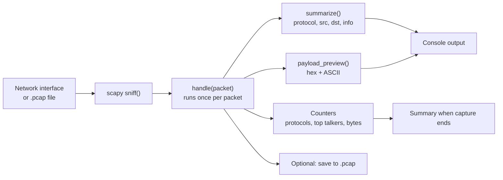

# CodeAlpha_NetworkSniffer

A basic **network packet sniffer** written in Python with [scapy](https://scapy.net/).
Built for the **CodeAlpha Cyber Security Internship, Task 1: Basic Network Sniffer**.

It captures traffic from a network interface (or reads a saved `.pcap` file), breaks each packet down layer by layer, and shows the useful parts: **source and destination IPs and ports, protocol, TCP flags, DNS names, HTTP request lines and a payload preview**. When it stops it prints a summary of what it saw.

> **Use it only on networks you own or have permission to monitor.** See [Legal and ethical use](#legal-and-ethical-use).

---

## Table of contents
1. [What it does](#what-it-does)
2. [How it works](#how-it-works)
3. [Requirements and installation](#requirements-and-installation)
4. [Usage](#usage)
5. [Sample output](#sample-output)
6. [Reading the output](#reading-the-output)
7. [Project structure](#project-structure)
8. [Testing](#testing)
9. [Limitations](#limitations)
10. [Legal and ethical use](#legal-and-ethical-use)
11. [What I learned](#what-i-learned)
12. [Further documentation](#further-documentation)

---

## What it does

| Feature | Details |
|---------|---------|
| Live capture | Sniffs any interface, with an optional BPF filter such as `tcp port 80` |
| Offline analysis | Reads `.pcap` files (including captures from Wireshark) with `-r` |
| Protocol decoding | Ethernet, **ARP**, **IPv4 / IPv6**, **TCP**, **UDP**, **ICMP**, **DNS**, **HTTP** |
| Per-packet details | Time, protocol, `source -> destination` (IP:port), size, plus TCP flags, ICMP type, DNS query name or HTTP request line |
| Payload preview | Hex and ASCII view of the first N payload bytes (default 48, adjustable, can be hidden) |
| Statistics | Protocol breakdown with percentages, top talkers, total packets and bytes |
| Save captures | Write what was captured to a `.pcap` with `-w` |
| Safe stop | Ctrl+C stops cleanly and still prints the summary |

## How it works



A packet is a set of nested layers. The sniffer checks them from the outside in:

```
Ethernet frame  ->  IP packet  ->  TCP or UDP segment  ->  application data (DNS, HTTP)
   (link)           (network)          (transport)             (application)
```

Full explanation, with a code walkthrough: [docs/DOCUMENTATION.md](docs/DOCUMENTATION.md).

## Requirements and installation

- **Python 3.8 or newer**
- **scapy** (`pip install -r requirements.txt`)
- **Windows:** [Npcap](https://npcap.com/) (tick *"Install Npcap in WinPcap API-compatible mode"*)
- **Linux / macOS:** libpcap (usually already installed)

```bash
git clone https://github.com/prateekc486/CodeAlpha_NetworkSniffer.git
cd CodeAlpha_NetworkSniffer
python -m pip install -r requirements.txt
```

> Use `python -m pip` so the package goes into the same Python that runs the script. If you have several Python versions installed, installing into a different one is the most common cause of `scapy is not installed`.

Live capture needs administrator rights: run the terminal **as Administrator** on Windows, or use `sudo` on Linux and macOS. Reading a `.pcap` file needs no special rights.

## Usage

```bash
python sniffer.py -l                        # list network interfaces
python sniffer.py -r sample.pcap            # analyse the included sample (no admin rights needed)
sudo python sniffer.py                      # live capture on the default interface, Ctrl+C to stop
sudo python sniffer.py -i eth0 -c 50        # stop after 50 packets on eth0
sudo python sniffer.py -f "tcp port 80"     # only HTTP traffic
sudo python sniffer.py -f "udp port 53"     # only DNS
sudo python sniffer.py -p 0                 # hide payloads
sudo python sniffer.py -w capture.pcap      # save the capture (open it in Wireshark)
```

On Windows, leave out `sudo` and run the terminal as Administrator.

| Flag | Meaning | Default |
|------|---------|---------|
| `-i`, `--iface` | Interface to sniff on | scapy's default |
| `-c`, `--count` | Stop after N packets (`0` = until Ctrl+C) | `0` |
| `-f`, `--filter` | BPF filter expression | none |
| `-p`, `--payload` | Payload bytes to show (`0` = hide) | `48` |
| `-w`, `--write` | Save captured packets to a `.pcap` file | off |
| `-r`, `--read` | Analyse an existing `.pcap` instead of sniffing | off |
| `-l`, `--list-ifaces` | List interfaces and exit | off |

## Sample output

Running `python sniffer.py -r sample.pcap` (the included file holds 8 synthetic packets):

```
[*] Reading sample.pcap
#1    18:29:20.111  ARP   192.168.1.10 -> 192.168.1.1  who-has 192.168.1.1 tell 192.168.1.10  (42 B)
#2    18:29:20.112  DNS   192.168.1.10:53211 -> 8.8.8.8:53  query example.com.  (71 B)
#3    18:29:20.112  DNS   8.8.8.8:53 -> 192.168.1.10:53211  response example.com.  (98 B)
#4    18:29:20.113  TCP   192.168.1.10:40000 -> 93.184.216.34:80  flags=[S] seq=100  (54 B)
#5    18:29:20.113  HTTP  192.168.1.10:40000 -> 93.184.216.34:80  GET /index.html HTTP/1.1  (101 B)
        hex  : 47 45 54 20 2f 69 6e 64 65 78 2e 68 74 6d 6c 20 48 54 54 50 2f 31 2e 31 0d 0a ...
        ascii: GET /index.html HTTP/1.1..Host: example.com....
#6    18:29:20.113  HTTP  93.184.216.34:80 -> 192.168.1.10:40000  HTTP/1.1 200 OK  (113 B)
        ascii: HTTP/1.1 200 OK..Content-Type: text/html....<htm
#7    18:29:20.114  ICMP  192.168.1.10 -> 1.1.1.1  echo-request  (50 B)
        ascii: abcdefgh
#8    18:29:20.114  ICMP  1.1.1.1 -> 192.168.1.10  echo-reply  (50 B)
        ascii: abcdefgh

============================================================
Captured 8 packets, 579 bytes total

Protocol breakdown:
  DNS          2  (25.0%)
  HTTP         2  (25.0%)
  ICMP         2  (25.0%)
  ARP          1  (12.5%)
  TCP          1  (12.5%)

Top talkers (by packets sent):
  192.168.1.10                                 5
  8.8.8.8                                      1
  93.184.216.34                                1
  1.1.1.1                                      1
============================================================
```

(Hex lines are shortened here; the real output shows the full preview.)

## Reading the output

Each packet line is: `#number  time  PROTOCOL  source -> destination  info  (size)`.

| Protocol | The info column shows | What it means |
|----------|----------------------|---------------|
| `ARP` | `who-has X tell Y` | A device asking "who owns IP X?" on the local network |
| `DNS` | `query example.com.` | A name lookup; responses are labelled `response` |
| `TCP` | `flags=[S] seq=100` | A TCP segment; the flags show the connection stage |
| `HTTP` | the request or status line | Unencrypted web traffic (readable on the wire) |
| `ICMP` | `echo-request`, `echo-reply` | Ping |
| `UDP` | `len=N` | Other UDP traffic |

**TCP flags**

| Flag | Name | Meaning |
|------|------|---------|
| `S` | SYN | Start a connection |
| `SA` | SYN-ACK | Server accepts the connection |
| `A` | ACK | Acknowledges received data |
| `PA` | PSH-ACK | Data being delivered immediately |
| `F` / `FA` | FIN | Orderly connection close |
| `R` / `RA` | RST | Connection aborted or refused |

IPv6 endpoints are printed as `[address]:port` so the port cannot be confused with part of the address.

## Project structure

```
CodeAlpha_NetworkSniffer/
├── sniffer.py                 # the sniffer
├── sample.pcap                # 8 synthetic packets for testing without admin rights
├── tools/
│   └── make_sample_pcap.py    # regenerates sample.pcap
├── docs/
│   └── DOCUMENTATION.md       # design, code walkthrough, protocol notes, testing
├── requirements.txt
├── LICENSE
└── README.md
```

## Testing

| Test | Command | Result |
|------|---------|--------|
| Decode all supported protocols | `python sniffer.py -r sample.pcap` | 8 packets: ARP, DNS x2, TCP, HTTP x2, ICMP x2 |
| Stop after N packets | `python sniffer.py -r sample.pcap -c 3` | exactly 3 packets and a summary |
| Hide payload | `python sniffer.py -r sample.pcap -p 0` | no hex/ASCII lines |
| Save and re-read a capture | `-r sample.pcap -w out.pcap`, then read `out.pcap` | same packets round-trip |
| IPv6 formatting | a TCP/IPv6 packet | shown as `[addr]:port`, host counted without the port |
| Sample file is reproducible | `python tools/make_sample_pcap.py` | identical packets to the shipped file |
| Live capture | `sudo python sniffer.py -c 20`, then browse a site | real packets decoded; needs admin rights and a real network |

## Limitations

- **HTTPS is encrypted**, so only the connection details are visible, not the page content. Plain HTTP and DNS are readable.
- No TCP stream reassembly: each packet is shown separately, so a large HTTP message split over several packets is not joined.
- HTTP is detected by the request method or `HTTP/` at the start of a packet's payload; a payload split mid-message may show as plain TCP.
- Only the first DNS question is shown.
- Capturing on Wi-Fi may only show your own device's traffic, depending on the adapter and driver.

## Legal and ethical use

Capturing network traffic can expose passwords and private data. Only run this tool on **your own network or with the written permission of the network owner**. Do not publish capture files that contain other people's traffic (the `.gitignore` excludes your own captures for that reason).

## What I learned

- How a packet is built from nested layers (Ethernet, IP, TCP/UDP, application data)
- What TCP flags such as SYN, ACK, FIN and RST say about the state of a connection
- Why unencrypted HTTP and DNS can be read by anyone on the path, and why HTTPS matters
- Why capturing needs administrator rights (raw socket access)
- How BPF filters narrow a capture efficiently

## Further documentation

- [docs/DOCUMENTATION.md](docs/DOCUMENTATION.md): objective, background, design, code walkthrough, testing and future work

Licensed under the [MIT License](LICENSE). Author: Prateek.
