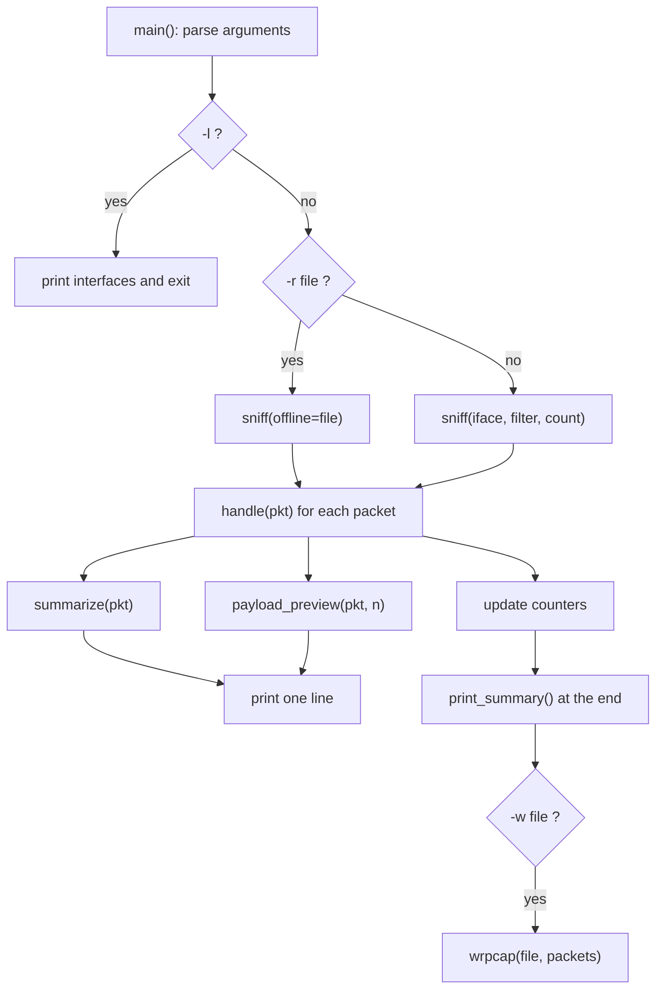

# Network Sniffer: Technical Documentation

**Project:** CodeAlpha Cyber Security Internship, Task 1
**Author:** Prateek
**Language / library:** Python 3, scapy

---

## 1. Objective

The task asks for a Python program that:

1. captures network traffic packets,
2. analyses them to understand their structure and content,
3. shows how data flows through the network and the basics of protocols, and
4. displays useful information such as source and destination IPs, protocols and payloads.

This project meets all four points with a command-line sniffer built on scapy.

## 2. Background

### 2.1 What a packet is
Data on a network travels in small units called packets. Each packet is wrapped in several **layers**, like envelopes inside envelopes. A sniffer opens them one by one.

| Layer | Name | Example protocols | What it carries |
|-------|------|-------------------|-----------------|
| 2 | Link | Ethernet, ARP | MAC addresses, local delivery |
| 3 | Network | IPv4, IPv6, ICMP | IP addresses, routing |
| 4 | Transport | TCP, UDP | Port numbers, reliability (TCP) |
| 7 | Application | HTTP, DNS | The actual request or answer |

### 2.2 Protocols the sniffer recognises

| Protocol | Role | Reference |
|----------|------|-----------|
| ARP | Maps an IP address to a MAC address on the local network | RFC 826 |
| IPv4 | Addressing and routing | RFC 791 |
| ICMP | Diagnostics, for example ping | RFC 792 |
| UDP | Fast, connectionless transport | RFC 768 |
| TCP | Reliable, connection-based transport | RFC 793 |
| DNS | Translates names such as `example.com` into IP addresses | RFC 1035 |
| HTTP | Web requests and responses (unencrypted) | RFC 9110 |

### 2.3 The TCP handshake (why flags matter)

```
Client                    Server
  | ---- SYN ---------->   |    "I want to connect"
  | <--- SYN-ACK -------   |    "OK, I accept"
  | ---- ACK ---------->   |    "Connected"
  | ---- PSH-ACK (data)->  |    data flows
  | ---- FIN ---------->   |    "I'm done"
```

Seeing `S`, `SA`, `A` in the output means a connection is being set up; `R` means it was refused or aborted.

### 2.4 Common ports

| Port | Service | Port | Service |
|------|---------|------|---------|
| 20/21 | FTP | 80 | HTTP |
| 22 | SSH | 123 | NTP |
| 25 | SMTP | 443 | HTTPS |
| 53 | DNS | 3389 | Remote Desktop |

## 3. Design

### 3.1 Data flow



### 3.2 Design decisions

| Decision | Reason |
|----------|--------|
| Use scapy instead of raw `socket` | scapy decodes dozens of protocols and also reads/writes `.pcap` files, so the code stays short and readable |
| `store=False` while sniffing | packets are processed and discarded, so memory stays flat even on a long capture; packets are only kept when `-w` is used |
| Handler written as a closure (`make_handler`) | the command-line options reach the handler without global state for settings |
| Offline mode (`-r`) | lets anyone test and demonstrate without admin rights or live traffic |
| Layer-by-layer detection in one function | one place to add a new protocol |

## 4. Code walkthrough (`sniffer.py`)

### 4.1 Imports and constants
- `sniff`, `wrpcap`, `get_if_list`, `Raw` from scapy; layer classes `IP`, `IPv6`, `TCP`, `UDP`, `ICMP`, `DNS`, `ARP`, `Ether`.
- If scapy is missing, the program exits with a clear message (`pip install scapy`) instead of a stack trace.
- `HTTP_METHODS`: the byte prefixes that mark the start of an HTTP message (`GET `, `POST `, `HTTP/` and so on).
- `ICMP_TYPES`: maps ICMP type numbers to names (0 echo-reply, 3 dest-unreachable, 8 echo-request, 11 time-exceeded).

### 4.2 `payload_preview(pkt, limit)`
Returns the first `limit` bytes of the packet's raw payload as a hex string and as printable ASCII (non-printable bytes become `.`). Returns `None` if the packet has no payload or `limit` is 0.

### 4.3 `endpoint(addr, port)`
Formats `address:port`. IPv6 addresses already contain colons, so they are wrapped as `[address]:port` to avoid ambiguity.

### 4.4 `summarize(pkt)`
The core of the decoder. It returns `(protocol, source, destination, info, source_host)` and checks layers in this order:

1. **ARP** present: report who-has / is-at.
2. **IP or IPv6** present: take the source and destination addresses. If neither exists, fall back to plain Ethernet (`ETH`) or `OTHER`.
3. **TCP**: show flags and sequence number. If the payload starts with an HTTP method or `HTTP/`, relabel as **HTTP** and show the first line (up to 80 characters).
4. **UDP**: show length. If a DNS layer exists, relabel as **DNS** and show `query` or `response` with the first question name. A broken DNS layer is caught and shown as `malformed DNS`.
5. **ICMP**: show the type name.
6. Anything else: `IP/<protocol number>`.

`source_host` is the bare address (no port); it feeds the top-talkers table.

### 4.5 `make_handler(args)` and `handle(pkt)`
Runs once per packet:
- increases the packet and byte counters,
- calls `summarize()` and updates the protocol and source counters,
- keeps the packet when `-w` was given,
- prints the one-line summary, then the payload preview if enabled.

### 4.6 `print_summary()`
Prints total packets and bytes, the protocol breakdown with percentages (`Counter.most_common()`), and the five busiest sources.

### 4.7 `build_parser()` and `main()`
`argparse` defines the flags. `main()` then:
- handles `-l` (list interfaces),
- chooses live or offline mode,
- catches `PermissionError` (suggests running as administrator or with `sudo`), `KeyboardInterrupt` (clean stop) and `OSError` (capture problems),
- prints the summary and writes the `.pcap` when requested.

## 5. Usage examples

### 5.1 BPF filters
BPF (Berkeley Packet Filter) is a small language for choosing which packets to capture. It runs in the capture library, so unwanted packets are dropped early.

| Goal | Filter |
|------|--------|
| Only web traffic | `tcp port 80 or tcp port 443` |
| Only DNS | `udp port 53` |
| One host | `host 192.168.1.10` |
| Only ping | `icmp` |
| Everything except SSH | `not port 22` |
| Only new connections | `tcp[tcpflags] & tcp-syn != 0` |

Example: `sudo python sniffer.py -f "udp port 53" -c 20`

### 5.2 A suggested live demo
1. Start the sniffer with a filter: `-f "udp port 53 or tcp port 80" -c 30`.
2. In a browser open `http://example.com` (plain HTTP).
3. Watch the DNS lookup appear first, then the TCP handshake (`S`, `SA`, `A`), then the `GET / HTTP/1.1` request line.
4. Compare with an `https://` site: the DNS lookup and handshake are visible, but the content is not.

## 6. Testing

### 6.1 Test data
`sample.pcap` holds 8 synthetic packets covering ARP, DNS (query and response), a TCP SYN, an HTTP request and response, and an ICMP echo request and reply. `tools/make_sample_pcap.py` regenerates it. All addresses are private or public DNS servers; no real user traffic is included.

### 6.2 Test cases and results

| # | Test | Expected | Result |
|---|------|----------|--------|
| 1 | Read `sample.pcap` | 8 packets, correct protocol labels | Pass |
| 2 | HTTP detection | packets 5 and 6 labelled `HTTP` with request and status line | Pass |
| 3 | DNS names | `query example.com.` and `response example.com.` | Pass |
| 4 | `-c 3` | exactly 3 packets | Pass |
| 5 | `-p 0` | no payload lines | Pass |
| 6 | `-w` then re-read | same number of packets | Pass |
| 7 | IPv6 TCP and UDP/DNS packets | `[addr]:port` format, host counted without port | Pass |
| 8 | Regenerate sample | byte-identical packets | Pass |
| 9 | `-l` | lists interfaces | Pass |
| 10 | Missing admin rights (live capture) | clear permission message | Code path only (`PermissionError` handler); not triggered in testing |

Live capture depends on the machine's network adapter and drivers, so it is tested by hand: run with administrator rights and generate traffic by browsing.

## 7. Limitations and ideas for improvement

| Limitation | Possible improvement |
|------------|----------------------|
| No TCP stream reassembly | Follow a connection and rebuild whole HTTP messages |
| HTTPS content not visible | Out of scope; this is correct behaviour for encrypted traffic |
| Only the first DNS question shown | Print all questions and answer records |
| Console only | Add CSV/JSON export or a live dashboard |
| No alerting | Flag suspicious patterns, such as many SYNs to many ports (port-scan detection) |
| Limited protocols | Add DHCP, TLS handshake details (SNI) and QUIC |

## 8. Security and ethics

- Packet capture can reveal credentials and personal data. Use only on your own network or with permission.
- Avoid committing captures to a public repository; the `.gitignore` blocks them by default.
- Many networks and laws treat unauthorised interception as an offence.

## 9. Learning outcomes

- Packets are layered, and each layer adds its own header.
- TCP flags describe a connection's life cycle.
- Unencrypted protocols expose their content to anyone who can observe the traffic.
- Offline analysis from `.pcap` files is as valuable as live capture for investigation and teaching.

## 10. References

- scapy documentation: https://scapy.readthedocs.io/
- Wireshark (for comparing results): https://www.wireshark.org/
- Npcap: https://npcap.com/
- RFC 768 (UDP), RFC 791 (IP), RFC 792 (ICMP), RFC 793 (TCP), RFC 826 (ARP), RFC 1035 (DNS), RFC 9110 (HTTP semantics)
